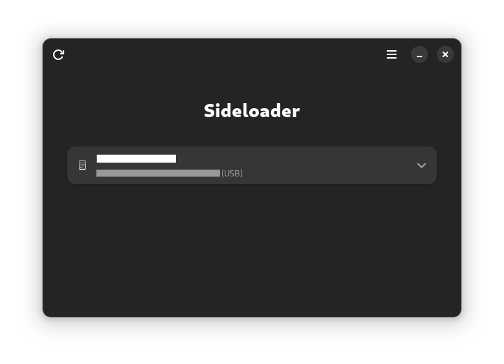

# Sideloader

*The missing open-source iOS sideloader.*

Sideloader is an application made to install third-party applications on iOS devices.

You can see it as an open-source replacement of _Cydia Impactor_.

<center>Leave a star and a small tip if you feel like it! — more information at the end!</center>

## Current state

Currently, there is a cross-platform CLI, with most features working.

And there is a Linux frontend based on GTK 4. It was the priority since no real alternative existed 
before.

A Qt frontend is being made for Linux, Windows and macOS.

A SwiftUI macOS GUI could be made (I got no Mac to work on that, but all the scaffolding code is here,
if someone wants to work on that).

I tried to make the code as readable as possible, if you struggle to understand anything
I am here to help! I don't want this to finish unmaintained!

## Usage

### GTK



### CLI

```sh
$ sideloader -h
Usage: sideloader [-d] [-h] <command> [<args>]

Available commands:
  app-id         Manage App IDs.
  cert           Manage certificates.
  install        Install an application on the device (renames the app, register
                 the identifier, sign and install automatically).
  sign           Sign an application bundle.
  team           Manage teams.
  tool           Run Sideloader's tools.
  version        Print the version.

Optional arguments:
  -d, --debug    Enable debug logging
  -h, --help     Show this help message and exit                                                                                                                                                                       
```

Additionally, AppleID user and password can be set via the environment variables `APPLE_ID_USER` and `APPLE_ID_PWD`.

Table of Contents
=================

  * [How to install](#how-to-install)
  * [How to use the CLI to install](#how-to-use-the-CLI-to-install)
  * [How do I build it myself?](#how-do-i-build-it-myself)
    * [OpenSUSE Tumbleweed](#opensuse-tumbleweed)
    * [Other distributions](#other-distributions)
  * [How it works?](#how-it-works)
  * [Features](#features)
  * [Notes on platform support](#notes-on-platform-support)
    * [Linux](#linux)
    * [Windows](#windows)
    * [MacOS](#macos)
  * [Acknowledgements and references](#acknowledgements-and-references)
  * [If you like my software, consider starring or even better: sponsoring me :)](#if-you-like-my-software-consider-starring-or-even-better-sponsoring-me-)

## How to install

Currently, the only builds available can be downloaded through GitHub Actions.

CLI builds include builds for every supported operating system, and GTK+ builds have a GUI
for Linux-based OSes.

When it will get a first release, there will probably be an easier download (not requiring an
account) in the Release tab of this repo, and hopefully it will be packaged as a Flatpak (even if
I currently don't see how to make it).

**Dependencies (at runtime):** libimobiledevice, libplist-2.X (I attempted to support both 2.2
and 2.3). OpenSSL is currently also needed, but I plan to remove that dependency as soon
as possible (only networking is requiring it).

*Note:* On Windows, MSVC builds of those libraries are needed as sideloader is built with MSVC.
It also implies you have to install Microsoft Visual C++ redistributable to run it, but you probably
already have those installed. Put them then in the same folder as Sideloader and you'll be able to
run it. (For libimobiledevice and libplist, take a look at libimobiledevice-win32, and for OpenSSL
see [this link](https://slproweb.com/products/Win32OpenSSL.html))

## How to use the CLI to install

1. Go to https://sidestore.io/ on your computer and download the SideStore.ipa file.
2. Download the most recent version of Sideloader from https://github.com/Dadoum/Sideloader/actions.
3. Use the following command to sideload the SideStore.ipa file (if there are errors, try running the command again):
	`sideloader install SideStore.ipa -i`
4. Enable Developer Mode on your iPhone if it's not already enabled.
5. Use the following command to generate the pairing file and send it to your phone:
	`sideloader tool run 0`
6. Download and install the Wireguard VPN app from the iOS App Store.
7. Visit https://sidestore.io/ on your phone and download the Wireguard Config file, then share it to the Wireguard app.
8. Enable the Wireguard VPN on your phone.
9. Open the SideStore app and sign in with the same Apple ID that you used to install SideStore in step 3.
10. Go to the Apps tab and refresh the SideStore app by tapping on the green day counter or selecting Refresh All. You must do this whenever you install SideStore, otherwise you may encounter errors like SideStore expiring earlier than it should.

## How do I build it myself?

### OpenSUSE Tumbleweed:

1. Install the dependencies:
   `sudo zypper in gcc dmd dub libharfbuzz-gobject0 libadwaita libphobos2-0_* libimobiledevice-1_0-6 git`
2. Clone this repository:
   `git clone https://github.com/Dadoum/Sideloader`
3. Enter its directory:
   `cd Sideloader`
4. Build Sideloader:
   `dub build`
5. Enter the bin directory:
   `cd bin`
6. Allow Sideloader to run as a program:
   `chmod +x sideloader`
7. Run Sideloader:
   `./sideloader`

### Other distributions:

Get a recent version `ldc2` or `dmd` installed (an installation script is available on 
[dlang.org](https://dlang.org/)). It is tested with D 2.104.2 (= LDC 1.34) but it will probably compile with
older compilers. GNU D compiler won't compile that code though (the cryptography library makes 
use of SIMD instructions that cannot be compiled by GDC yet).

## How it works?

It works by fetching an iOS development certificate as Xcode would do if you were
developing your own iOS application[^1] and use it to deploy a third party application.

It does not require any Mac or Windows computer, nor any Apple software to be
installed to work. It is just requiring `libimobiledevice` and `libplist`.

It is still requiring you to have an Apple account (which will play the role of the
app developer to Apple), you can use any account for that, don't need to use your actual
Apple ID used with your phone (I recommend making a burner Apple account, see SideStore 
wiki to have easy ways to do that, or on Linux, I'd recommend installing Apple Music on 
Waydroid).

**Your credentials are only ever sent to Apple servers, and you can easily verify this!**\
In general, never trust anyone to handle your credentials, even more if it is in a
closed-source obfuscated application (as-if there were something to hide there ^^).

[^1]: You may wonder if that would allow full iOS application development on Linux, and
the answer is yes! You can compile a native iOS app on Linux with
[theos](https://theos.dev), and then package it into an ipa with `PACKAGE_FORMAT = ipa` to
eventually install it with Sideloader on a real device (or maybe even an emulated one
in the future!) and debug it (with `idevicedebug` or remote `lldb`). _(TODO: add an option
to add the entitlement for debugging)_

## Features

- Sideload
- Sign IPAs
- Set-up SideStore's pairing file
- Manage App IDs and certificates for free developer accounts.
- iOS version range is unknown. 32-bit support is untested. Please report any issue here!!

## Acknowledgements and references

- [People on this thread](https://github.com/horrorho/InflatableDonkey/issues/87): first
cues on the authentication systems for both machines and accounts.
- All the people in the SideStore team: testing, help on the machine authentication.
- All the people in the AltStore team: help on the account auth, and 2FA (especially 
kabiroberai's code).
- zhlynn: for its code in zsign.
- indygreg: for its code in rcodesign.
- teryx: [their article about code signature](https://medium.com/csit-tech-blog/demystifying-ios-code-signature-309d52c2ff1d).
- Apple Music for Android libraries: giving the opportunity to make all of this work 
neatly!
- Apple's AuthKit and AuthKitWin: giving me the skeleton of the authentication requests 
directly.
- Probably a lot of people I missed!

## If you like my software, consider starring or even better: sponsoring me :)

In late 2019, Cydia Impactor stopped working, and the underlying reason also affected
some of my personal projects at the time. At this time, I decided to start the development
of an alternative. I had no experience in reverse-engineering, or even just making complex
request for authentication on a server. Making this project made me a better developer,
but this was not easy to do. 

While most Cydia Impactor alternatives benefited of some Apple software available on
macOS or Windows, (and thus were able to hijack their libraries and reproduce their
behaviour), Apple never released anything targeting the end-user on Linux.

I took 2 years to find a way to overcome the problem that encountered Cydia Impactor
without resorting to reimplementing the full Windows API. I dedicated a lot of work
on this software (alongside my studies). 

That is why I am asking you - if you enjoyed my software and if you can afford it, to 
give me a small tip via [GitHub Sponsors](https://github.com/sponsors/Dadoum).
